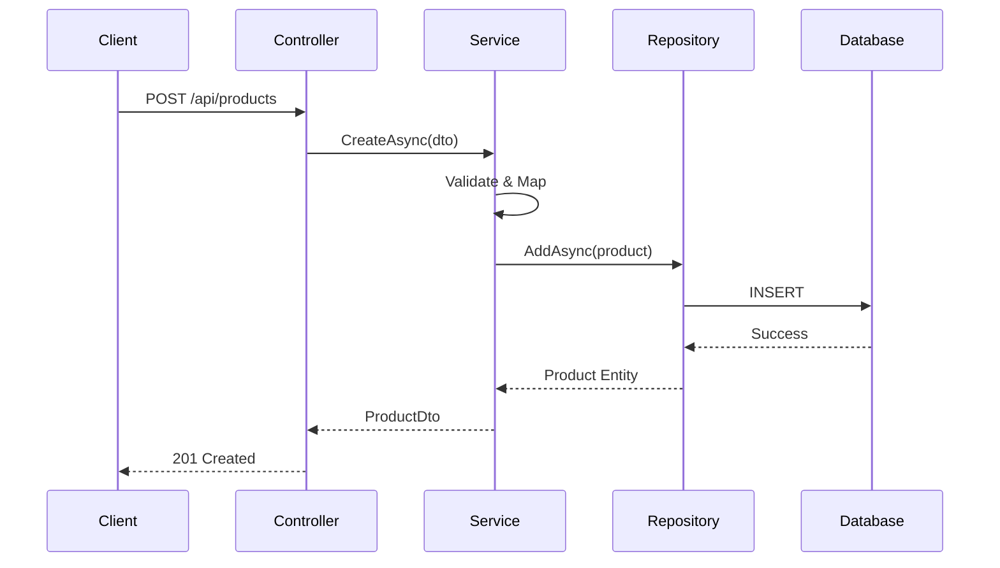

# 🏗️ Arquitetura do Product Catalog API

## Visão Geral

O **Product Catalog API** é uma aplicação desenvolvida em **.NET 8** seguindo os princípios da **Clean Architecture** (Arquitetura Limpa) e **SOLID**. A aplicação implementa um sistema de gerenciamento de catálogo de produtos com funcionalidades completas de CRUD, upload de imagens, filtros avançados e paginação.

## 📐 Padrões Arquiteturais

### Clean Architecture

A aplicação segue os princípios da Clean Architecture, organizando o código em camadas concêntricas onde:

- **Camadas internas** não dependem de camadas externas
- **Regras de negócio** ficam isoladas no núcleo (Domain)
- **Dependências** apontam sempre para dentro (Dependency Inversion)
- **Interfaces** definem contratos entre camadas

### Princípios SOLID

- **S** - Single Responsibility: Cada classe tem uma única responsabilidade
- **O** - Open/Closed: Aberto para extensão, fechado para modificação
- **L** - Liskov Substitution: Subtipos devem ser substituíveis por seus tipos base
- **I** - Interface Segregation: Interfaces específicas são melhores que interfaces gerais
- **D** - Dependency Inversion: Dependa de abstrações, não de implementações concretas

## 🏛️ Estrutura de Camadas

```
┌─────────────────────────────────────┐
│           Presentation              │
│        (ProductCatalog.API)         │
├─────────────────────────────────────┤
│          Application                │
│    (ProductCatalog.Application)     │
├─────────────────────────────────────┤
│            Domain                   │
│      (ProductCatalog.Domain)        │
├─────────────────────────────────────┤
│         Infrastructure              │
│   (ProductCatalog.Infrastructure)   │
└─────────────────────────────────────┘
```

### 1. 🎯 Domain Layer (ProductCatalog.Domain)

**Responsabilidade**: Núcleo da aplicação contendo regras de negócio puras.

**Componentes**:
- **Entities**: Entidades de domínio (`Product`, `BaseEntity`)
- **Enums**: Enumerações (`ProductStatus`)
- **Interfaces**: Contratos para repositórios e serviços (`IProductRepository`, `IImageStorageService`)
- **Pagination**: Classes para paginação (`PageList<T>`, `PageParams`)

**Características**:
- ❌ Não possui dependências externas
- ✅ Contém apenas lógica de negócio
- ✅ Entidades com encapsulamento adequado
- ✅ Validações de domínio

```csharp
// Exemplo: Entidade Product com encapsulamento
public class Product : BaseEntity
{
    public string Name { get; private set; }
    public decimal Price { get; private set; }
    
    public Product(string name, decimal price, string category)
    {
        // Validações e regras de negócio
        ValidateProduct();
    }
}
```

### 2. 🔧 Application Layer (ProductCatalog.Application)

**Responsabilidade**: Orquestração de casos de uso e lógica de aplicação.

**Componentes**:
- **Services**: Implementação de casos de uso (`ProductService`)
- **DTOs**: Objetos de transferência de dados (`CreateProductDto`, `UpdateProductDto`)
- **Interfaces**: Contratos de serviços de aplicação (`IProductService`)
- **Mappings**: Mapeamentos AutoMapper (`ProductMappingProfile`)
- **Validators**: Validações FluentValidation (`CreateProductDtoValidator`)

**Padrões Implementados**:
- **Service Pattern**: Encapsulamento de lógica de aplicação
- **DTO Pattern**: Transferência de dados entre camadas
- **Mapping Pattern**: Conversão entre DTOs e Entidades
- **Validation Pattern**: Validação de entrada

```csharp
// Exemplo: Serviço de aplicação
public class ProductService : IProductService
{
    private readonly IProductRepository _repository;
    private readonly IMapper _mapper;
    
    public async Task<ProductDto> CreateAsync(CreateProductDto dto)
    {
        // Orquestração do caso de uso
        var product = _mapper.Map<Product>(dto);
        await _repository.AddAsync(product);
        return _mapper.Map<ProductDto>(product);
    }
}
```

### 3. 🌐 Presentation Layer (ProductCatalog.API)

**Responsabilidade**: Interface de entrada da aplicação (Web API).

**Componentes**:
- **Controllers**: Endpoints da API (`ProductsController`)
- **Middleware**: Tratamento de exceções (`GlobalExceptionMiddleware`)
- **Configuration**: Configuração da aplicação (`Program.cs`)

**Características**:
- ✅ RESTful API design
- ✅ Swagger/OpenAPI documentation
- ✅ Global exception handling
- ✅ Dependency injection configuration

### 4. 🔌 Infrastructure Layer (ProductCatalog.Infrastructure)

**Responsabilidade**: Implementação de detalhes técnicos e acesso a recursos externos.

**Componentes**:
- **Data**: Contexto Entity Framework (`ProductCatalogDbContext`)
- **Repositories**: Implementação de repositórios (`ProductRepository`)
- **Services**: Serviços de infraestrutura (`LocalImageStorageService`)
- **Migrations**: Migrações do banco de dados

**Tecnologias**:
- **Entity Framework Core 9.0**: ORM
- **PostgreSQL**: Banco de dados
- **File System**: Armazenamento de imagens

## 🔄 Fluxo de Dados

### Requisição HTTP Típica

```
1. HTTP Request → Controller
2. Controller → Application Service
3. Application Service → Domain Entity
4. Application Service → Repository Interface
5. Repository Implementation → Database
6. Response ← Controller ← Application Service
```

### Exemplo: Criação de Produto



## 🔧 Injeção de Dependências

### Configuração por Camada

**Application Layer** (`DependencyInjection.cs`):
```csharp
services.AddScoped<IProductService, ProductService>();
services.AddAutoMapper(typeof(ProductMappingProfile));
services.AddFluentValidation();
```

**Infrastructure Layer** (`DependencyInjection.cs`):
```csharp
services.AddDbContext<ProductCatalogDbContext>();
services.AddScoped<IProductRepository, ProductRepository>();
services.AddScoped<IImageStorageService, LocalImageStorageService>();
```

## 📊 Modelo de Dados

### Entidade Principal: Product

```csharp
public class Product : BaseEntity
{
    public string Name { get; private set; }           // Nome do produto
    public string Description { get; private set; }    // Descrição
    public decimal Price { get; private set; }         // Preço
    public string Category { get; private set; }       // Categoria
    public ProductStatus Status { get; private set; }  // Status (Active/Inactive)
    public string? ImageUrl { get; private set; }      // URL da imagem
}
```

### Base Entity

```csharp
public abstract class BaseEntity
{
    public int Id { get; protected set; }
    public DateTime CreatedAt { get; protected set; }
    public DateTime UpdatedAt { get; protected set; }
    public DateTime? DeletedAt { get; protected set; }  // Soft Delete
}
```

## 🔍 Funcionalidades Implementadas

### CRUD Completo
- ✅ **Create**: Criação de produtos com validação
- ✅ **Read**: Listagem com filtros e paginação
- ✅ **Update**: Atualização de produtos existentes
- ✅ **Delete**: Soft delete de produtos

### Filtros Avançados
- 🏷️ **Por Categoria**: Filtro por categoria específica
- 💰 **Por Preço**: Faixa de preço (mínimo e máximo)
- 📊 **Por Status**: Ativo/Inativo
- 🔄 **Combinados**: Múltiplos filtros simultaneamente

### Paginação
- 📄 **PageList<T>**: Implementação customizada
- 🔢 **PageParams**: Parâmetros de paginação
- 📊 **Metadata**: Informações de paginação na resposta

### Upload de Imagens
- 📁 **Armazenamento Local**: Sistema de arquivos
- 🔒 **Validação**: Formato e tamanho
- 🌐 **Servir Estático**: Acesso via URL

## 🧪 Estratégia de Testes

### Cobertura por Camada

**Domain Tests**:
- ✅ Validação de regras de negócio
- ✅ Comportamento de entidades
- ✅ Construtores e métodos

**Application Tests**:
- ✅ Lógica de serviços
- ✅ Mapeamentos
- ✅ Validações
- ✅ Tratamento de exceções

**Infrastructure Tests**:
- ✅ Operações CRUD
- ✅ Consultas com filtros
- ✅ Configurações EF Core

### Ferramentas de Teste
- **xUnit**: Framework de testes
- **FluentAssertions**: Assertions fluentes
- **Moq**: Mocking framework
- **InMemory Database**: Testes de integração

## 🐳 Containerização

### Docker Multi-Stage Build

```dockerfile
# Build stage
FROM mcr.microsoft.com/dotnet/sdk:8.0 AS build-env
COPY . ./
RUN dotnet publish -c Release -o out

# Runtime stage
FROM mcr.microsoft.com/dotnet/aspnet:8.0
COPY --from=build-env /app/out .
CMD ["dotnet", "ProductCatalog.API.dll"]
```

### Docker Compose

- **API Container**: Aplicação .NET
- **PostgreSQL Container**: Banco de dados
- **Volume Persistence**: Dados persistentes
- **Network**: Comunicação entre containers

## 🔒 Segurança e Boas Práticas

### Implementadas
- ✅ **Global Exception Handling**: Tratamento centralizado
- ✅ **Input Validation**: FluentValidation
- ✅ **Soft Delete**: Exclusão lógica
- ✅ **Encapsulation**: Propriedades privadas nas entidades
- ✅ **Dependency Injection**: Inversão de controle

### Recomendações Futuras
- 🔐 **Authentication/Authorization**: JWT tokens
- 🛡️ **Rate Limiting**: Controle de taxa
- 📝 **Logging**: Structured logging
- 🔍 **Health Checks**: Monitoramento
- 📊 **Metrics**: Observabilidade

## 🚀 Escalabilidade

### Pontos de Extensão

**Novos Provedores de Armazenamento**:
```csharp
public interface IImageStorageService
{
    Task<string> SaveImageAsync(IFormFile file, string fileName);
}

// Implementações: LocalImageStorageService, AzureBlobStorageService, S3StorageService
```

**Novos Repositórios**:
```csharp
public interface IRepository<T> where T : BaseEntity
{
    Task<T> GetByIdAsync(int id);
    Task<PageList<T>> GetPagedAsync(PageParams pageParams);
}
```

**Novos Serviços de Aplicação**:
```csharp
public interface IService<TDto, TCreateDto, TUpdateDto>
{
    Task<TDto> CreateAsync(TCreateDto dto);
    Task<TDto> UpdateAsync(int id, TUpdateDto dto);
}
```

## 📈 Métricas e Performance

### Otimizações Implementadas
- 🗃️ **Índices de Banco**: Category, Status, Price, DeletedAt
- 📄 **Paginação**: Evita carregamento excessivo
- 🔍 **Filtros Eficientes**: Queries otimizadas
- 💾 **Lazy Loading**: Carregamento sob demanda

### Monitoramento Recomendado
- ⏱️ **Response Time**: Tempo de resposta
- 🔢 **Request Count**: Número de requisições
- ❌ **Error Rate**: Taxa de erro
- 💾 **Memory Usage**: Uso de memória
- 🗄️ **Database Performance**: Performance do banco

---

## 📚 Referências

- [Clean Architecture - Robert C. Martin](https://blog.cleancoder.com/uncle-bob/2012/08/13/the-clean-architecture.html)
- [SOLID Principles](https://en.wikipedia.org/wiki/SOLID)
- [.NET 8 Documentation](https://docs.microsoft.com/en-us/dotnet/)
- [Entity Framework Core](https://docs.microsoft.com/en-us/ef/core/)
- [ASP.NET Core Web API](https://docs.microsoft.com/en-us/aspnet/core/web-api/)

---

*Documentação criada para o Product Catalog API - Versão 1.0*